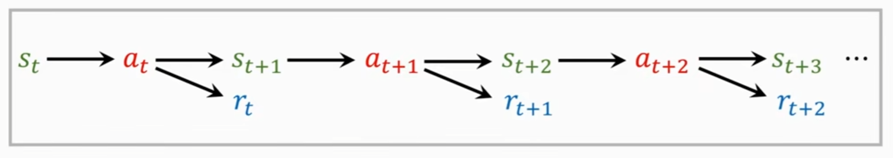
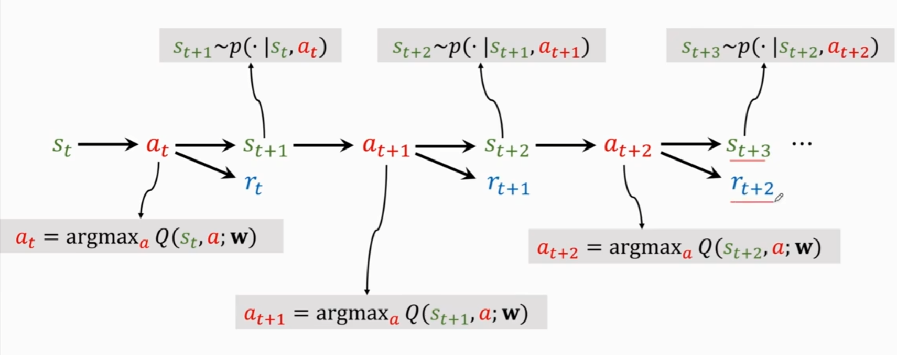
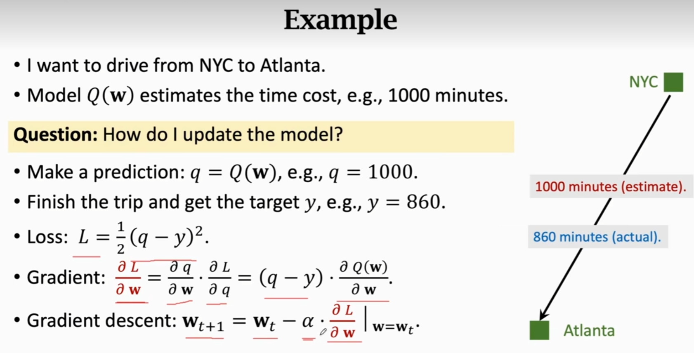

# 入门
1. 强化学习**两个随机性来源**
   1. 动作根据给定的环境，计算**下一步每种动作**的概率，而随机生成
   2. 下一时间的**环境状态**根据当前的环境状态和动作而随机生成
2. 三元组（s1,a1,r1………st,at,rt）(state，action，reward)
3. **折扣汇报**，未来的奖励没现在的奖励值钱
$$
G_t=R_t+\gamma R_{t+1}+ \dots
$$
为什么回报与未来的奖励有关，与过去的奖励无关？
过去的因为是已经改变不了的了，不是个变量了，而强化学习做的是在当前状态下该采取什么动作，做了当前的动作是为了未来更好才去做的
4. **动作价值函数（Action-value function）**$Q_\pi(s_t,a_t)=E[G_t|S_t=s_t,A_t=a_t]$，因为没办法直接求$G_t$，所以只能通过概率去求其期望，转化为状态价值函数（与policy $\pi$有关 ）,这个函数是**用来评价当前的动作好不好**，这里的期望是根据未来的所有可能的状态$A_{t+1},A_{t+2}...$和动作($S_{t+1},S_{t+2},...$)求的

5. **optimal Action-value function**:$Q^*(s_t,a_t)=\underset{\pi}{max}Q_\pi(s_t,a_t)$，作用为评价当前的动作,找一个最好的policy $\pi$，使得当前的动作最好
6. **State-value function**:$V_\pi(s_t)=E_A[Q_\pi(s_t,A)]$，可以判断**当前局势好不好**，因为是对所有动作求期望，所以是对当前局势的评价
$$
V_\pi(s_t)=E_A[Q_\pi(s_t,A)]=\begin{cases}
    \Sigma_a[Q_\pi(s_t,a)\pi(a|s_t)] & \text{if } discrete\\
    \int_a[Q_\pi(s_t,a)\pi(a|s_t)]da & \text{if } continuous
\end{cases}
$$
$E_s[V_\pi(S) ]$也可以**评价当前$policy \pi$的好坏**，因为是对所有状态求期望，所以是对整个policy的评价
7. **agent学习方式**：根据当前的观察状态$s_t$
   1. 策略学习(policy $\pi(a|s)$)
   2. 价值学习(optimal value function $Q^*(s,a)$)
8. **学习过程**
   
9. **贝尔曼方程**及其推导
   1. 状态值函数的贝尔曼方程
        $$
        V^{\pi}(s) = \mathbb{E}_{a \sim \pi(s)} \left[ R(s, a) + \gamma \, \mathbb{E}_{s' \sim P(s'|s, a)} \left[ V^{\pi}(s') \right] \right]
        $$
        1. 状态值函数的贝尔曼方程是一个递归方程，它表示了一个状态的值与其后继状态的值之间的关系。
        2. 推导过程：
            $$
            \begin{array}{l}
            V^{\pi}(s) = \mathbb{E}_{\pi} \left[ G_t | S_t = s \right] \\
            = \mathbb{E}_{\pi} \left[ R_{t+1} + \gamma G_{t+1} | S_t = s \right] \\
            = \mathbb{E}_{\pi} \left[ R_{t+1} + \gamma V^{\pi}(S_{t+1}) | S_t = s \right] \\
            = \mathbb{E}_{\pi} \left[ R(s, A) + \gamma V^{\pi}(S') | S = s \right] \\
            = \mathbb{E}_{a \sim \pi(s)} \left[ R(s, a) + \gamma \, \mathbb{E}_{s' \sim P(s'|s, a)} \left[ V^{\pi}(s') \right] \right]
            \end{array}
            $$
    2. 动作值函数的贝尔曼期望方程
        $$
        Q^{\pi}(s, a) = R(s, a) + \gamma \, \mathbb{E}_{s' \sim P(s'|s,a)} \left[ \mathbb{E}_{a' \sim \pi(s')} \left[ Q^{\pi}(s', a') \right] \right]
        $$
        1. 动作值函数的贝尔曼方程是一个递归方程，它表示了一个状态动作对的值与其后继状态动作对的值之间的关系。
        2. 推导过程：
            $$
            \begin{array}{l}
            Q^{\pi}(s, a) = \mathbb{E}_{\pi} \left[ G_t | S_t = s, A_t = a \right] \\
            = \mathbb{E}_{\pi} \left[ R_{t+1} + \gamma G_{t+1} | S_t = s, A_t = a \right] \\
            = \mathbb{E}_{\pi} \left[ R_{t+1} + \gamma Q^{\pi}(S_{t+1}, A_{t+1}) | S_t = s, A_t = a \right] \\
            = \mathbb{E}_{\pi} \left[ R(s, a) + \gamma Q^{\pi}(S', A') | S = s, A = a \right] \\
            = R(s, a) + \gamma \, \mathbb{E}_{s' \sim P(s'|s,a)} \left[ \mathbb{E}_{a' \sim \pi(s')} \left[ Q^{\pi}(s', a') \right] \right]
            \end{array}
            $$
    3. 状态值函数的贝尔曼最优方程
        $$
        V^*(s) = \max_{a} \left[ R(s, a) + \gamma \, \mathbb{E}_{s' \sim P(s'|s,a)} \left[ V^*(s') \right] \right]
        $$
        1. 状态值函数的贝尔曼最优方程是一个递归方程，它表示了一个状态的值与其后继状态的值之间的关系。
        2. 推导过程：
            $$
            \begin{array}{l}
            V^*(s) = \max_{a} \left[ Q^*(s, a) \right] \\
            = \max_{a} \left[ R(s, a) + \gamma \, \mathbb{E}_{s' \sim P(s'|s,a)} \left[ V^*(s') \right] \right]
            \end{array}
            $$
    4. 动作值函数的贝尔曼最优方程
        $$
        Q^*(s, a) = R(s, a) + \gamma \, \mathbb{E}_{s' \sim P(s'|s,a)} \left[ \max_{a'} Q^*(s', a') \right]
        $$
        1. 动作值函数的贝尔曼最优方程是一个递归方程，它表示了一个状态动作对的值与其后继状态动作对的值之间的关系。
        2. 推导过程：
            $$
            \begin{array}{l}
            Q^*(s, a) = \mathbb{E}_{\pi^*} \left[ G_t | S_t = s, A_t = a \right] \\
            = \mathbb{E}_{\pi^*} \left[ R_{t+1} + \gamma G_{t+1} | S_t = s, A_t = a \right] \\
            = \mathbb{E}_{\pi^*} \left[ R_{t+1} + \gamma \max_{a'} Q^*(S_{t+1}, a') | S_t = s, A_t = a \right] \\
            = \mathbb{E}_{\pi^*} \left[ R(s, a) + \gamma \max_{a'} Q^*(S', a') | S = s, A = a \right] \\
            = R(s, a) + \gamma \, \mathbb{E}_{s' \sim P(s'|s,a)} \left[ \max_{a'} Q^*(s', a') \right]
            \end{array}
            $$

    
10.  DQN（Deep Q-Network）(离散型)
    用深度学习来近似Q函数
    目标：最大化奖励函数  
    问题1：如何通过已知的$Q^*(s,a)$来寻找最好动作
    答：$a^*=\underset{a}{argmax}Q^*(s,a)$  
    挑战：$Q^*(s,a)$是未知的，只能通过已知的数据来近似
    答：用神经网络$Q(s,a;w)$来近似$Q^*(s,a)$（DNQ） 
    训练过程：
    
     
11. Temporal Difference(TD) Learning
    最简单的例子
    
    Q: Can I update the model before the end of the episode?
    A: 前半段实际值，后半段预测值，加起来作为一个值去与模型的整体估计值作比较

12. 
